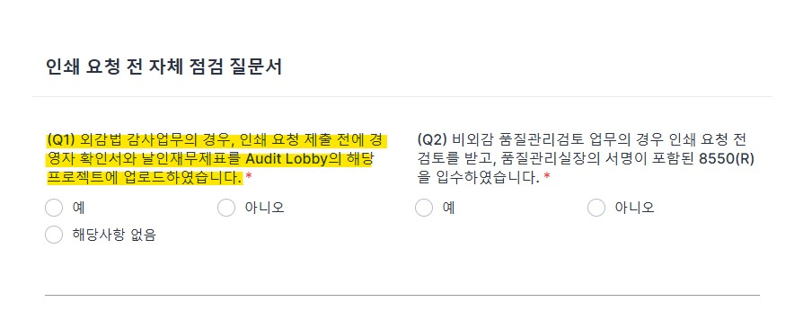
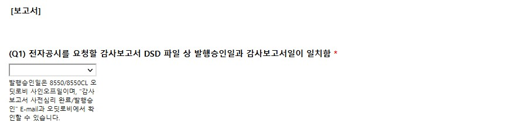
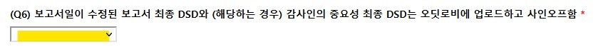

## 발행

### 개요

법인의 업무 계약은 일반적으로 보고서 발행과 용역 계약 기간의 만료 두 가지 방법으로 이행됩니다. 여기서 발행 절차를 설명하겠습니다.

감사기준서, 품질관리기준서는 발행 승인 이후를 다루고 있지 않습니다. 따라서 관리 목적에서 발행을 정의하여야합니다.

**발행**이란 고객과의 계약에 따라 업무를 수행하고 업무수행 결과인 보고서를 제작하여 법인 명의로 고객에게 제출하여 계약을 이행하는 것을 의미합니다. 따라서 발행은 다음을 모두 포괄하는 용어입니다.

1. 법인 공인인증서로 [전자 서명](https://www.law.go.kr/LSW/lsLinkProc.do?lsNm=%EC%A0%84%EC%9E%90%EC%84%9C%EB%AA%85%EB%B2%95&efYd=20120329&lsId=prec20120329&lsClsCd=L&joNo=000300&mode=11&lnkJoNo=undefined)된 공시 파일 작성
2. 법인 대표이사 명의의 인감(이하, '법인인감')이 날인된 인쇄물 제출
3. 법인인감 날인을 생략한 인쇄물 제출
4. 법인인감이 날인된 보고서 파일 제출
5. 법인인감 날인을 생략한 보고서 파일 제출

**미발행 용역**이란 발행이 없는 용역 업무를 의미합니다. 

**지정 인쇄소**란 업무팀에서 인쇄물 형태 혹은 파일 형태의 보고서를 제작할 수 있도록 법인에서 지정한 인쇄소를 의미합니다. 

### 발행승인

발행의 정의와 [공인회계사법 제34조](https://www.law.go.kr/법령/공인회계사법/(20210721,18114,20210420)/제34조)와 [정관 제24조]()에 따르면 인증업무의 발행승인 권한은 대표이사에게 있습니다. 품질관리제도의 운영을 원활히하기 위하여 법인의 [내규](https://seonjin-qualitycontrol.github.io/policy.github.io/policy/90-%ED%92%88%EC%A7%88%EA%B4%80%EB%A6%AC%EA%B7%9C%EC%A0%95/#29)는 감사보고서의 발행승인 권한을 품질관리업무 담당이사에게 위임하였습니다. 

품질관리제도 관점에서 발행의 관리 목적은 법인 명의로 발행되는 보고서에 승인권자의 승인이 있었는지 확인하는데 있습니다. 인쇄, 인감 날인 등의 관리를 이해하기 위해 우선 발행승인에 대해 확인하여야 합니다.

#### 감사보고서

감사보고서란 외부감사법에 의한 감사, 기타 법령에 의한 감사 및 임의 감사의 결과물을 의미합니다.

- 감사보고서 발행 승인

    감사보고서 발행 전 다음 절차가 필요합니다. 세부 내용은 [품질관리절차-업무품질관리검토-사전심리와 품질관리검토]()를 참조해주세요.

    1. 업무팀은 DART 편집기의 감사보고서 서식에 따라 감사보고서를 작성하고, 재무제표와 외부감사실시내용을 첨부합니다. (이하 함께 '감사보고서등')
    2. 업무팀은 법령에서 요구하는 감사인의 중요성 금액 서식('중요성서식')을 작성합니다.
    3. 업무팀은 업무품질관리 절차에 감사보고서등과 중요성서식을 사전심리 실시자·품질관리검토 담당자에게 제출합니다.
    4. 사전심리 실시자/품질관리검토 담당자는 품질관리업무 담당이사에게 사전심리·품질관리검토의 종료를 알립니다.     
    5. 사전심리 결과를 확인한 품질관리업무 담당이사는 ‘심리사항점검표(8550)’에 서명하여 감사보고서의 발행을 승인합니다. 

- 외부감사법에 따른 감사보고서 정정 발행 승인

    품질관리업무 담당이사의 발행승인이 필요한 업무에 대하여 정정공시가 필요한 경우 법인에서 정한 정정공시 절차를 진행하여 발행승인을 받아야 합니다. 감사보고서 발행 이후 수행되는 이 절차에는 감사조서의 수정 절차가 필요할 수 있습니다. 

#### 감사보고서 이외의 보고서

담당이사의 승인으로 발행됩니다. 현재, 품질관리실은 업무팀에서의 발행 승인 과정은 통제하지 않습니다. 공시 요청 혹은 인쇄 요청을 담당이사의 발행 승인으로 간주하겠습니다.

!!! note "담당이사의 발행승인 권한"

    법과 내규는 감사보고서 이외의 인증업무, 기타 비인증업무의 발행 승인 권한에 대해 정하고 있지 않습니다. 법인은 이러한 업무의 산출물은 담당이사의 발행승인 대상으로 보아 관리하고 있습니다. 감사보고서의 발행과 달리 발행의 결정이 체계적으로 문서화되고 있지 않습니다.

### 감사보고서 산출물 제작

감사보고서는 산출물의 물리적 형태에 따라 크게 두 가지로 구분할 수 있습니다. 전자문서는 작성 형식에 따라 다시 구분되며, 인쇄물은 제작 방법에 따라 다시 나눌수 있습니다.

- 전자문서:
    - [DART 문서편집기](https://newfiler.fss.or.kr/raaf001/select.do)로 작성된 문서 (.DSD)
    - 기타 범용 문서편집기(한글, MS워드 등)로 작성된 문서 (.HWP, .DOC, .PDF)
- 인쇄물: 작성된 전자문서를 책자형태로 제작한 결과물. 
    - 지정인쇄소에서 제작
    - 자체 제작

### 인쇄

인쇄는 지정인쇄소를 통한 제작과 자체 제작이 모두 가능합니다. 

#### 지정인쇄소

지정인쇄소 제도는 발행 통제와 인감 관리 목적으로 운영하고 있습니다. 현재 본점과 대구지점 각각 인쇄소가 지정되어있습니다. [Forms and Templates-발행-인쇄](https://sjacc-quality-portal.com/forms)를 통해 지정인쇄소에 의뢰할 수 있습니다. [내규](https://seonjin-qualitycontrol.github.io/policy.github.io/policy/90-%ED%92%88%EC%A7%88%EA%B4%80%EB%A6%AC%EA%B7%9C%EC%A0%95/#29)에 따라 발행된 보고서 사본 1부를 품질관리업무 담당이사에게 제출하여야합니다. 지정인쇄소에서 제작하는 경우 제출이 불필요합니다.

!!! note "인쇄의뢰서식 작성관련 주의사항"

    1. 온라인 서식의 E-mail은 법인 E-mail 주소를 입력하여야 합니다. 선진회계법인 Email(@sjacc.co.kr)을 입력하지 않으면 서식 제출 버튼이 활성화되지 않습니다.
        

    2. 계약번호는 “계약 단위로” 건 별 작성하여 제출해주시기 바랍니다. (온라인 서식 1건에 계약 1건에 대해서만 작성). 계약 단위로 온라인 서식이 작성되지 않으면 인쇄가 진행되지 않는 점 유의하여 주시기 바랍니다.
        

    3. 인쇄 의뢰 온라인 서식 제출 전에 수령한 ①경영자 확인서와 ②날인재무제표를 Audit Lobby에 업로드 완료해야 합니다.업무수행팀에서는 사전심리 절차가 완료되는 즉시 감사대상회사로부터 경영자확인서와 날인재무제표를 입수하시기 바랍니다.
        

#### 자체제작

업무팀에서 복합기와 제본 도구 등을 활용하여 인쇄물을 자체제작할 수 있습니다. 자체제작의 경우 제작후 [지체없이](https://www.lawmaking.go.kr/lmKnlg/jdgStd/info?astSeq=19&astClsCd=CF0101#:~:text=%EC%9D%B4%EC%97%90%20%EB%B9%84%ED%95%98%EC%97%AC%20'%EC%A7%80%EC%B2%B4%20%EC%97%86%EC%9D%B4'%EB%8A%94,%ED%95%9C%EB%8B%A4%EB%8A%94%20%EB%9C%BB%EC%9C%BC%EB%A1%9C%20%EC%82%AC%EC%9A%A9%ED%95%9C%EB%8B%A4.) 품질관리실로 사본 1부를 제출해주세요.

### 인증

인증(Authenticity)은 해당 보고서가 선진회계법인에서 제출된 것이 맞다는 것, 즉 문서의 진정성을 확인하는 절차입니다. 인증의 방법은 일반적으로 서명·기명·날인(인장 이미지 포함)·공인전자서명이 있습니다. 법인은 현재 기명날인, 공인전자서명의 방법으로 산출 보고서의 제출자가 선진회계법인이라는 것을 인증합니다.

!!! warning 

    날인이나 전자서명이 없이 선진회계법인이라 기명하여 업무 산출물을 제출하는 경우 선진회계법인은 진본성을 인정하지 않습니다. 

#### 전자서명

법인은 DART 제출용 전자문서의 작성에 전자서명을 사용합니다. 금융감독원의 [전자문서제출요령](https://newfiler.fss.or.kr/raaf001/search.do)에서 구체적인 사항을 확인할 수 있습니다. 

1. DRT 생성

    DART편집기에서 문서 작성이 완료되면 문서파일(.DSD)을 전자서명하여 전송파일(.DRT 형식, 이하 'DRT')로 만듭니다. 전자서명을 위한 인증서는 품질관리실에서 보관합니다. 업무팀은 [Form and Template-발행-DRT생성](https://sjacc-quality-portal.com/forms)을 통해 품질관리실에 DRT 생성을 요청할 수 있습니다.

    !!! note "전자공시 전송파일 생성/제출 서식 주의사항"

        1. 외부감사업무의 감사보고서일(품질관리업무 담당이사 또는 담당이사의 8550 사인오프일)을 입력해주시기 바랍니다. 감사보고서일은 업무품질관리검토 종료일입니다. 세부 내용은 [품질관리절차-업무품질관리검토-사전심리와 품질관리검토]()를 참조해주세요.
        
            
            

        2. 외부감사 실시내용과 ERP 등록시간 일치, 미결재시간 없음, 담당이사 투입비율 10% 초과, 내규에 따른 사전심리 시간 조건 충족을 확인 후 '예'를 선택합니다.

            
                       
                       

        3. 제출하는 DSD 파일은 ① 헤더정보 입력 ② 파일 형식검사 ③ 재무제표 검사(일반기업회계기준)를 수행해야합니다. 재무제표 검사 과정에서 필요한 경우 계정을 신설합니다. 검사 수행자의 PC의 C:\DART\User에 회사의 증선위 고유번호로된 DAT파일이 생성됩니다. 신설계정목록을 제출하기 위하여 DAT파일을 첨부합니다. DAT파일이 생성되지 않는 경우(ex. 범위제한으로 인한 의견거절, 저축은행 등 일반기업회계기준을 적용하는 금융업의 경우). 3-1에 아니오를 선택합니다.

            

        4. 감사인의 중요성과 기업개황은 헤더정보 입력 후 파일 형식검사로 형식적 문제를 해소한 후 제출하여야 합니다.

            

        5. 최종 ① 감사보고서 DSD파일과 ② 감사인의 중요성 DSD파일을 Audit Lobby에 업로드 후 사인오프가 완료되었음을 확인 후, 답변을 “예“ 로 선택합니다. 감사보고서일을 정확하게 수정해주세요.

            

        6. 수령한 ① 경영자 확인서 ② 날인 재무제표를 Audit Lobby에 업로드 후 사인오프가 완료되었음을 확인 후, 답변을 “예“ 로 선택합니다. 
        
            

            !!! warning 
            
                경영자 확인서와 날인 재무제표는 감사증거입니다. 감사보고서일보다 제출일이 늦을 수 없습니다. 주의 부탁드립니다.

        7. 품질관리실에서는 ①서명된 경영자 확인서 와 ②날인 재무제표가 Audit Lobby에 업로드 및 사인오프가 완료되었음을 확인후 전자공시 전송파일을 생성합니다.

2. 법인이 제출의무자인 경우 - 품질관리실에서 제출합니다.

    감사보고서 등 법인이 제출의무자인 경우 품질관리실은 작성된 DRT를 지체없이 DART 접수시스템에 제출합니다. 품질관리실은 제출 결과를 업무팀에 회신합니다. 회신내용은 **DART 공시 조회 결과**와 **DART 접수시스템 제출결과조회 상세페이지**의 캡처 화면입니다. 회신이 없는 경우 품질관리실에 문의해주세요.
    
    감사보고서와 첨부서류의 제출의무자가 법인이 아닌 경우에도, 감사인의 중요성 서식은 법인이 제출의무자입니다. 제출여부를 반드시 품질관리실과 더블체크해주세요.
    
3. 법인이 제출의무자가 아닌 경우 - 품질관리실에서 제출의무자에게 DRT를 보냅니다. 

    DRT 생성 요청서에는 제출의무자의 업무담당자 E-mail 주소를 기록할 수 있습니다. 품질관리실은 생성된 DRT를 제출의무자에게 직접 송부합니다. 다음은 E-mail 제출 서식입니다.

        Subject : [선진회계법인] XXX 주식회사 감사보고서 DRT 송부
        Date : 202X-XX-XX XX:00:00
        From : 품질관리실 <qualitycontrol@sjacc.co.kr>
        To : XXX@XXXXX
        Cc : 품질관리실 <qualitycontrol@sjacc.co.kr>, 업무팀

        선진회계법인 품질관리실입니다.

        1. 귀 사의 무궁한 발전을 기원합니다.
        2. 전자공시용 DRT 파일을 보내드립니다. 업무에 참고하시기 바랍니다.

        기타 문의사항이 있으신 경우, 담당공인회계사 또는 품질관리실에 연락 부탁드립니다. 

        감사합니다.

#### 인감

인감 날인은 다시 다음과 같이 구분할 수 있습니다. 

- 실물
- 인감 이미지
    - 지정 인쇄소
    - 교부 이미지

## 변경이력

절차의 추가, 수정, 삭제 등 주요 변경 내역을 기록하고 있습니다.

### 변경계획

#### 추가

- 승인권자 구체화

#### 수정

- 승인권자 구체화

### [1.0.0] - 2023-01-24

최초 배포. 아래 하이웍스 공지 내역을 종합하여 대체함.

- [[품질관리실] 인감관리절차 - 보고서 각인 이미지 사용 관련 추가 사항 안내](https://board.office.hiworks.com/sjacc.co.kr/bbs/board/board_view/7328/554#)
    - [[품질관리실] 발행승인 후 발행방법 추가 - 감사보고서 사각도장 실물 날인](https://board.office.hiworks.com/sjacc.co.kr/bbs/board/board_view/7328/546#)
- [[품질관리실] 재발행·정정공시 발행 승인절차 업데이트 안내 (2022-09)](https://board.office.hiworks.com/sjacc.co.kr/bbs/board/board_view/7328/544#)
    - [[품질관리실] 재발행·정정공시 발행 승인절차 안내](https://board.office.hiworks.com/sjacc.co.kr/bbs/board/board_view/7328/427#)
- [[품질관리제도] 분반기 검토보고서 발행 절차 안내 (2022 업데이트)](https://board.office.hiworks.com/sjacc.co.kr/bbs/board/board_view/7328/518#)
    - [[품질관리제도] 분반기 검토보고서 발행 절차 안내 (2021년 계획 포함) - outdated](https://board.office.hiworks.com/sjacc.co.kr/bbs/board/board_view/7328/442#)
- [[품질관리실] [내부공지] 발행절차 정비 - 기업진단보고서 제출 추가](https://board.office.hiworks.com/sjacc.co.kr/bbs/board/board_view/7328/482#)
    - [[품질관리실] 발행절차 정비 안내](https://board.office.hiworks.com/sjacc.co.kr/bbs/board/board_view/7328/412#)