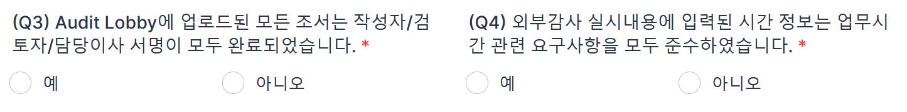

<!-- ## 사전심리와 품질관리검토 -->

품질관리실은 외부감사법에 따라 업무품질관리검토 절차를 수립하여 운영하고 있습니다. 업무품질관리검토 대상 업무의 결과물은 배정된 업무품질관리 검토자의 발행전 검토를 받습니다.

내규([#](../policy/90-%ED%92%88%EC%A7%88%EA%B4%80%EB%A6%AC%EA%B7%9C%EC%A0%95#29))에 따라 감사보고서의 발행은 품질관리업무 담당이사의 승인 대상입니다.

역시 내규에 따라 품질관리업무 담당이사는 대상업무의 발행전 사전심리([#](https://seonjin-qualitycontrol.github.io/policy.github.io/policy/90-%ED%92%88%EC%A7%88%EA%B4%80%EB%A6%AC%EA%B7%9C%EC%A0%95/#35)) 또는 품질관리검토([#](https://seonjin-qualitycontrol.github.io/policy.github.io/policy/90-%ED%92%88%EC%A7%88%EA%B4%80%EB%A6%AC%EA%B7%9C%EC%A0%95/#401))를 요구합니다. 이하 사전심리와 품질관리검토 절차를 구체적으로 설명합니다.

### 사전심리

사전심리 대상, 사전심리 실시자의 배정, 요청자, 실시자가 수행할 구체적 절차와 문서화 사항를 설명합니다.

#### 사전심리 대상

다음 감사 업무는 내규([#](https://seonjin-qualitycontrol.github.io/policy.github.io/policy/90-%ED%92%88%EC%A7%88%EA%B4%80%EB%A6%AC%EA%B7%9C%EC%A0%95/#35))에 따라 사전심리 대상입니다.

- 외감규정에 따라 사전심리 의무: 주권상장법인, 대형비상장주식회사, 금융회사, 감사인 지정을 받은 회사, 분사무소 소속 공인회계사가 감사업무를 수행한 회사
- 내규에 사전심리 대상에 추가 반영: 사업보고서 제출대상 회사, 직전 회계연도에 비적정의견을 받은 회사, 공공기관, K-IFRS 적용, 연결 FS 작성, 초도 또는 신규감사
- 품질관리업무 담당이사 지정: 상증세법상 감사인 지정을 받은 비외감법 감사업무

!!! note "사전심리대상의 식별"

        사전심리 대상은 외부감사대상과의 감사계약 체결 시점에 식별됩니다. 대상회사의 또는 감사업무의 특성의 변화애 따라 추가되거나 제외될 수 있습니다. 내규는 사전심리 대상의 식별 시점을 특정하지 않았으나, 사전심리 실시자의 자격 요건이 성과평가 이후인 점, 연결 감사보고서의 제출 일정, 반기 심리 일정 등을 고려할 때 6월 초에 심리대상 연차 확정하겠습니다. 이 후 12월 말까지 업데이트 내역은 주기적으로 업데이트되는 독립성 명부에서 확인할 수 있도록 관리하겠습니다.

!!! note "사유가 복수로 적용되는 경우"

        에를 들어, 주권상장법인이며 주기적 지정으로 수임한 회사의 경우 사전심리 사유는 '주권상장법인'입니다. 

!!! note "현황 업데이트"

        계약 후 다음의 사유로 특성이 변할 경우 심리대상이 될 수 있습니다. 계약 상황에 대해 지속적으로 모니터하여 업데이트해주십시오.
        
        - 감사보고서 제출로 대형비상장 여부 확정
        - 적용기준 K-IFRS로 변경
        - 기중 투자에 따라 종속회사 추가되어 연결 재무제표 작성 필요

!!! note "지정 사유 부연 설명"

        - 분사무소 소속 공인회계사가 감사업무를 수행한 회사는 대구지점의 모든 외부감사법 감사업무를 의미합니다. 
        - 비적정의견은 한정, 부적정, 의견거절 등 의견변형 뿐 아니라 계속기업 불확실성에 대한 강조사항이 기재된 적정의견도 포함합니다. 공공기관은 공공기관 운영에 관한 법률에 따라 지정된 기관([#](https://www.alioplus.go.kr/organization/organByPub.do#:~:text=%EA%B3%B5%EA%B3%B5(%E5%85%AC%E5%85%B1)%EA%B8%B0%EA%B4%80%EC%9D%B4%20%EB%AC%B4%EC%8A%A8,%EC%A7%80%EC%A0%95%ED%95%9C%20%EA%B8%B0%EA%B4%80%EC%9D%84%20%EC%9D%98%EB%AF%B8%ED%95%A9%EB%8B%88%EB%8B%A4.))입니다. 
        - 초도감사는 전기에도 외감법 감사 대상이었으나 감사인을 선진회계법인으로 교체한 경우를, 신규감사는 전기에 외감법 감사 대상이 아니었고 당기 외감법 대상이 된 경우입니다.

#### 품질관리검토 대상 

외부감사법에 의한 감사 업무 중 사전심리 대상이 아닌 업무는 품질관리검토 대상입니다. 또한, 다음의 업무도 품질관리검토 대상입니다.

- DART에 공시되거나 금융감독원 등에 제출되는 비감사업무에 대한 보고서(예: 외부평가기관의 평가보고서 또는 실사보고서 등)
- 감사인 등의 조직 및 운영 등에 관한 규정 제5조제1항제2호부터 제19호까지에 해당하는 감사(이하, “기타법감사”)에 대한 감사(검토)보고서
- 그 외 품질관리업무 담당이사가 품질관리검토가 필요하다고 인정한 보고서
    1. 임의감사 보고서

### 사전심리절차

사전심리 요청시에는 [Quality Portal-Forms and Templates](https://sjacc-quality-portal.com/forms)의 사전심리 서식의 Instruction에 따라 자체 점검 완료 후 관련 자료를 첨부하여 제출하여 주시기 바랍니다.

사전심리 각 단계별 수행주체와 절차는 아래와 같습니다.

|단계|수행절차|수행도구|수행자|
|-|-|-|-|
|심리의뢰|1. 감사조서 및 감사증거 Audit Lobby에 업로드 후 사인오프 완료|Audit Lobby|업무팀|
||2. 감사수행 결과 등록 메뉴 정보 입력 후 저장|ERP|업무팀|
||3. 사전심리 서식으로 심리 의뢰|Quality Portal|업무팀|
|심리수행|4. 심리 8550CL 리뷰 및 보완|E-mail|심리실시자 업무팀|
||5. 김리실시자의 심리 진행 및 리뷰사항 보완|E-mail|심리실시자 업무팀|
||6. 심리실시자 필수조서 사인오프 수행|Audit Lobby|심리실시자|
||7. 심리실시자 Audit Lobby QC 조서 업로드 및 사인오프|Audit Lobby|심리실시자|
|심리종료|8. 심리실시자 심리 종료 (필요한 경우 미해결 이슈 코멘트 기재하여 품질관리실장에게 전달)|E-mail|심리실시자|
|발행승인|9. 품질관리업무 담당이사 8550/8550CL 조서 사인오프로 발행 승인|Audit Lobby|품질관리업무 담당이사|

#### 사전심리의뢰 유의사항

사전심리의뢰시 자체점검 질문서를 다음사항 유의하여 작성해주시기 바랍니다.

- 담당이사가 리뷰 후 1번 질문에 대한 답변을 “예” 선택합니다. 사전심리 요청 시 담당이사 혹은 업무수행팀에서 감사보고서에 대한 사전검토가 수행되었음을 확인합니다.
    
    !!! warning "사인오프 보고서 스캔 등 제출 불필요"

        FY2021까지 담당이사 리뷰 후 서명한 하드카피 보고서를 제출하도록 하였으나, 효과성이 떨어져 본 질문에 대한 답으로 수행여부를 확인하겠습니다

- 사전심리 의뢰자는 Audit Lobby에 [필수 일반조서](/qcProcedures/workingPaper/#_11)가 모두 업로드 되었는지 확인 후 2번 질문에 대한 답변을 “예” 로 선택합니다. ‘중요성요약표’는 QC 포탈에서 제공하는 [선진 서식](https://sjacc-quality-portal.com/forms)을 사용합니다.

- Audit Lobby의 모든 조서에 서명이 완료되었음을 확인 후, 3번 질문에 대한 답변을 “예” 로 선택 후, Audit Lobby Sign off History출력본 PDF를 첨부합니다. 사인오프가 누락된 조서가 있는 상태로 사전심리를 요청하는 경우가 발생하고 있습니다. 감사조서로써 사용하지 않는 파일의 경우 Audit Lobby에서 삭제가 필요합니다. 

    ??? note "사인오프 히스토리 확인방법"

        
        

- 외부감사 실시내용에 업무 시간 관련 요구사항을 모두 준수하였는지 확인 후, 4번 질문에 대한 답변을 “예” 로 선택합니다. 아래의 예시를 참고바랍니다.
    - 담당이사는 총시간의 10% 이상을 업무에 투입하여야 합니다(⑥). 사전심리 실시자는 내규에서 정한 충분한 업무시간을 투입해야합니다(⑦).
    - 미결재 업무시간이 있는지 확인합니다(⑤) (ERP-업무시간관리-계약별 총투입/심리시간 통계) 
    - 외부감사 실시내용의 투입인원, 투입시간은 ERP의 감사업무시간집계표(G-160)와 일치하여야 합니다(①, ②, ③, ④). (ERP-업무시간관리-감사업무시간집계표(G-160))
    
        !!! warning "기중 담당이사가 변경된 경우 2인 이상 담당이사 가능"

            기중 담당이사가 변경된 경우 2인 이상 담당이사를 외부감사실시내용으로 보고할 수 있습니다. 담당이사 변경시에도 기존 담당이사는 감사보고서 발행 또는 퇴사 시점까지 독립성을 유지해야 합니다.

    

- 중요성 요약표(2700) 조서에 중요성 금액 산정기준이 구체적으로 충실히 기재되었는지 확인 후, 5번 질문에 대한 답변을 “예” 로 선택합니다. 
    - 감사인의 중요성 금액 DSD파일의 중요성금액과 중요성 요약표(2700)조서의 중요성 금액은 일치해야 합니다.
    - 감사인의 중요성 금액 DSD 파일은 외부감사 및 회계 등에 관한 규정 및 시행세칙, 중요성 조서, 내규에 근거하여 작성/제출합니다.

- ERP 감사수행 결과 등록에서 필요한 정보가 모두 기입되었는지 확인 후, 6번 질문에 대한 답변을 “예” 로 선택합니다. 
    - 감사수행 결과 등록은 “ERP-품질관리-감사수행결과-감사수행 결과 등록”에서 처리합니다.

        !!! note "감사수행결과등록 Schedule"

            감사수행결과 등록에서 감사업무 결과로 생성된 고객과 업무 정보를 ERP에 기록합니다. 감사수행결과 등록에서 관리된 정보는 감사조서 입고시 다시 제출합니다. 각각의 일자는 오딧로비의 사인오프 히스토리에서 외부감사업무 필수조서에 담당이사와 사전심리담당자가 사인오프한 날짜입니다.

            

!!! warning "감사보고서일"

        - 외부감사법 감사업무 중 사전심리 대상의 감사보고서일은 사전심리 실시자가 8550과 8550CL에 사인오프한 날입니다. 품질관리업무 담당이사는 사전심리 대상의 감사보고서일과 발행승인일이 경우 후속사건에 대한 보완 후, 그 결과에 대해 다시 사인오프할 것을 요구할 것입니다. 따라서, 외부감사법 감사업무 중 사전심리 대상의 감사보고서일은 품질관리업무 담당이사의 발행승인일과 일치합니다.
        - 외부감사법 감사업무 중 품질관리검토 대상의 감사보고서일은 담당이사가 감사종료 조서에 사인오프한 날입니다.
        - 비외부감사법 감사업무의 감사보고서일은 담당이사가 감사종료를 결정한 날입니다. 발행승인과 달리 감사종료는 체계적으로 문서화하고 있지 않습니다.

        

### 품질관리검토 

품질관리검토 대상, 품질관리검토 실시자의 배정, 품질관리검토 절차와 문서화를 설명합니다.

### What is the point

## 변경이력

절차의 추가, 수정, 삭제 등 주요 변경 내역을 기록하고 있습니다.

### 변경계획

#### 추가/수정

### [1.0.0] - 2023-02-17

최초 배포

<!-- 추가/변경/삭제 -->