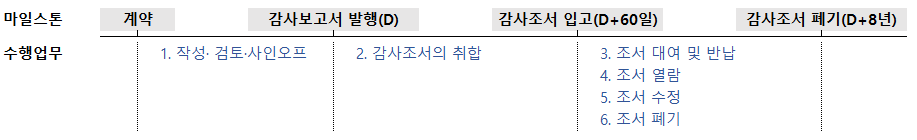

## 개요

감사업무수행 결과인 감사조서의 관리 절차를 설명합니다. 조서관리는 계약에서 보관의무가 종료되는 시점까지 법규에 따라 정해진 원칙을 준수하기 위한 여러 절차입니다. 아래 그림에서 나열한 수행업무를 이하 구체적으로 설명하겠습니다.

### 관련 규정과 관리 목표

감사조서에 관한 일반 사항은 [감사기준서 230 감사문서]()와 관련 법규를 따릅니다. 특히 [외감규정 별표 1](https://www.law.go.kr/LSW//admRulBylContentsInfoR.do?bylSeq=2475125)는 다음과 같이 규정하고 있습니다.

!!! quote "외감규정 별표 1의 2. 물적설비 및 업무방법"

    바. 감사조서 등 감사업무 관련 정보의 생산부터 보존까지의 모든 과정에 걸쳐 진본성(眞本性), 무결성(無缺性), 신뢰성 및 이용가능성이 보장될 수 있도록 관리하는 체계를 갖출 것

상기 규정은 [KS X ISO15489-1 문헌정보-기록관리](https://www.standard.go.kr/KSCI/standardIntro/getStandardSearchView.do?menuId=919&topMenuId=502&upperMenuId=503&ksNo=KSXISO15489-1&tmprKsNo=KSXISO15489-1&reformNo=05)를 차용하고 있습니다. 해당 국가표준에서 진본성, 무결성, 신뢰성 및 이용가능성이 의미하는 바를 확인할 수 있습니다.

??? quote "KS X ISO 15489-1 문헌정보-기록관리 5.2.2 공신력 있는 기록의 특징"

    5.2.2.1 진본성

    진본 기록은 다음과 같은 사항을 입증할 수 있는 것이다.

    a) 기록이 표방하는바 그대로의 기록인지 b) 그것을 생산했거나 보낸 것으로 되어 있는 바로 그 행위주체가 생산했거나 보냈는지 c) 기록에 명시된 시점에 생산되었거나 보내졌는지

    기록의 진본성을 보장하기 위해 기록의 생산, 획득, 관리를 통제하는 업무 규칙, 프로세스, 방침 및 절차(6.2)를 이행하고 문서화하여야 할 것이다. 기록 생산자는 승인되고 식별되어야 할 것이다(6.3참조)

    5.2.2.2 신뢰성

    신뢰성 있는 기록은:

    a) 기록이 입증하고자 하는 처리행위, 활동 또는 사실의 완전하고 정확한 표현물로서 해당 기록의 내용을 신뢰할 수 있고 b) 이후의 처리행위 또는 활동 과정에서 의존할 수 있는 것이다.

    기록은 사실에 대한 직접적인 지식을 가진 개인에 의해서 또는 처리행위를 위해 일상적으로 활용하는 시스템에 의해서, 관련된 사건이 일어난 시점이나 또는 바로 뒤에 생산되어야 할 것이다.

    5.2.2.3 무결성

    무결성을 가진 기록은 완전하고 변경되지 않은 것이다.

    기록은 허가받지 않은 변경이 이루어지지 않도록 보호되어야 할 것이다. 기록 관리에 대한 방침과 절차에서는 생산된 이후의 기록에 무엇을 추가 또는 부기(annotations)해도 되는지, 어떤 조건에서 추가 또는 부기를 승인해도 되는지, 그리고 누구에게 그 권한을 부여할지를(6.2 참조) 명시하여야 할 것이다. 기록에 대한 승인된 추가, 부기 또는 삭제는 어떤 것이든 명확하게 표시되고 추적할 수 있도록 하여야 할 것이다.

    5.2.2.4 이용가능성

    이용가능성 있는 기록은 이해관계자들이 합당하다고 여기는 시간 안에 위치를 찾을 수 있고, 검색할 수 있으며, 보여 줄 수 있고, 해석할 수 있는 것이다.

    이용가능성 있는 기록은 그것을 생산한 업무의 프로세스나 처리행위와 연계되어야 할 것이다. 연관된 업무 처리행위를 문서화한 기록 사이의 연계는 유지되어야 할 것이다.

    기록 메타데이터는 식별자, 포맷이나 저장 정보와 같이 기록을 검색하고 보여주는 데 필요할 경우, 정보를 제공함으로써 기록의 이용가능성을 지원해야 할 것이다(5.2.3 참조).

이에 더하여 관련 규정이 명시적으로 요구하고 있지는 않지만, [디지털 증거의 수집·분석 및 관리 규정 제8조](https://www.law.go.kr/행정규칙/디지털증거의수집·분석및관리규정/(1151,20210101)/제8조)에서 전자정보 압수, 수색, 검증의 기본원칙의 하나로 제시한 보관의 연속성(chain of custody)을 고려할 필요가 있습니다.

!!! quote "디지털 증거의 수집·분석 및 관리 규정 제8조"

    디지털 증거는 최초 수집된 상태 그대로 어떠한 변경도 없이 보관되어야 하고, 이를 위해 보관 주체들 간의 연속적인 승계 절차를 관리하는 등의 조치를 취해야 한다.

상기 전문가 기준과 관련 법규에서 등록법인에게 요구한 바에 따라, 품질관리실은 진본성, 무결성, 신뢰성, 이용가능성, 보관의 연속성을 확보할 수 있도록 조서관리 절차를 설계·운영합니다.

### 조서관리자

품질관리업무 담당이사는 [내규]()에 따라 본점과 지점에 각각 1인의 조서관리자를 지명하였습니다.

### 조서의 보관

#### 서면조서

법인은 직전기 조서를 조서관리자가 지정한 장소에 보관하고 있습니다. 기간이 경과하면 직전기 조서를 서울 문정동에 위치한 조서창고로 이관하여 법정기간동안 보관합니다.

|보관소|직전기 조서 [1]|과거 조서 [2-8]|
|-|-|-|
|본점|품질관리실 책장|문정동 조서창고|
|대구지점|조서관리자 지정장소|문정동 조서창고|

서면조서대장은 ERPiU-조서관리 기능을 사용합니다. 

#### 전자조서

법인은 외부 Application인 Audit Lobby로 전자조서를 관리합니다.

Audit Lobby 사용법은 [Audit LOBBY User Guide](https://userguide.auditlobby.com/)를 참고하시기 바랍니다. 품질관리실과 업무팀의 사용 권한이 다릅니다. 사용자 등록관리와 Archive 복사본 생성 등은 업무팀 계정으로 수행할 수 없습니다. 품질관리실과 상의해주시기 바랍니다.

## 입고전

### 작성·검토·사인오프

#### 조서 템플릿

품질관리실은 현재 일반목적의 감사 메뉴얼을 제공하고 있지 않습니다. 따라서 일반목적 감사조서 템플릿을 관리하고 있지 않습니다. 

품질관리실은 한국공인회계사가 매년 제공하는 조서 템플릿을 안내하고 있습니다. 한공회 서식은 감사기준에 따라 감사를 수행할 수 있도록 가이드로 사용하시고, 구체적인 절차의 수행 결과는 업무팀의 판단에 따라 조서화하시기 바랍니다. 

현행 서식은 [Quality Portal-Forms and Templates-현행서식파일](https://sjacc-quality-portal.com/forms)에서 입수바랍니다.  

#### 사인오프 일반원칙

법인은 품질관리제도에 전자서명을 전면 도입하였습니다. 품질관리절차에 사용하는 하이웍스·ERPiU·오딧로비는 모두 외부 Application으로 내부 관리자가 DB를 수정할 수 없습니다. 따라서 백데이팅(back-dating)이 불가능합니다[^1].

모든 업무팀 생성 조서는 작성자와 검토자 각각의 사인오프가 필요합니다. 

1. 아래 설명하는 필수조서는 담당이사가 검토자로 사인오프합니다. 필수조서는 인차지 등 업무팀원이 작성하는 것을 원칙으로 합니다. [내규](/policy/90-품질관리규정/#28)에 따라 외부감사업무 최소 투입 인력이 2인인 것을 고려할 때 가능한 조건이라 판단합니다. 

2. 업무수행이사가 계정을 담당하는 경우 업무팀원 중 1인이 해당 업무조서를 검토하고 사인오프합니다. 

[^1]:

    백데이팅은 조서의 공신력을 훼손하며, 이를 허용할 경우 법인의 품질관리제도의 근간이 흔들린다는 점에서 등록제 안정화 단계에서 서면조서 사인오프를 제거한다는 목표로 제도를 개선하였습니다.

#### 외부감사법 감사업무 필수조서

외부감사법에 의한 감사업무는 다음 조서를 전산조서로 제출합니다.

|조서번호|조서명|대상 회사|사전심리실시자 사인오프|
|-|-|-|-|
|1300A-개시 (1300B 포함)  1300A-종결 (1300B 포함)|독립성 준수 검토 조서 (개별 감사 참여자의 독립성 준수 확인서)|All|O|
|7100-개시 (7100A 포함)  7100-종결 (7100A 포함)|그룹 독립성 준수 검토 조서 (그룹 감사 참여자의 독립성 준수 확인서)|All|O|
|2100|감사계획의 수립|All|O|
|2100A|업무분장표|All|X|
|2100B|감사업무시간 집계표|All|X|
|2110-1|감사전략계획서|상장·대형비상장 금융회사·증선위지정 필수|O|
|7200|그룹감사계획의 수립|그룹감사|O|
|2700 (2700A 포함)  연결 2700 (2700A 포함)|중요성 (중요성요약표 및 산정 Template)|그룹감사|X|
|8400|공시사항점검표|All|X|
|8700|감사종료|All|O|
|7570|그룹감사 종료|그룹감사|O|

#### 모든 업무참여자의 사인오프가 필요한 감사조서

감사 조서 사인오프는 업무참여자가 업무투입 시점과 종료시점에 수행합니다. 업무팀원은 사인오프로 독립성 준수여부를 확인합니다. 업무팀원이 독립성 준수기간 동안 입력한 업무시간을 취합하여 외부감사실시내용으로 공시합니다. 한편, 업무팀원은 감사종료 조서에 사인오프하여 업무수행이사의 결론이, 본인의 업무 결과 입수된 감사증거에 부합하는지를 확인합니다.

|조서번호|조서명|대상 참여자|
|-|-|-|
|1300A-개시 (1300B 포함)|독립성 준수 검토 조서 (개별 감사 참여자의 독립성 준수 확인서)|감사업무에 참여하는 모든 참여자(변경 담당이사 및 내부전문가 등 포함)가 감사 업무에 참여하는 시점에 서명|
|1300A-종결 (1300B 포함)|독립성 준수 검토 조서 (개별 감사 참여자의 독립성 준수 확인서)|업무시간을 입력한 모든 참여자(내부전문가 등 포함)가 감사종료시점(또는 퇴사시점)에 서명|
|2100A|업무분장표|업무참여자가 업무분장내용을 확인한 시점에 서명|
|7100-개시 (7100A 포함)|그룹 독립성 준수 검토 조서 (그룹 감사 참여자의 독립성 준수 확인서)|감사업무에 참여하는 모든 참여자(변경 담당이사 및 내부전문가 등 포함)가 감사 업무에 참여하는 시점에 서명|
|7100-종결 (7100A 포함)|그룹 독립성 준수 검토 조서 (그룹 감사 참여자의 독립성 준수 확인서)|업무시간을 입력한 모든 참여자(내부전문가 등 포함)가 감사종료시점(또는 퇴사시점)에 서명|
|8700|감사종료|시간을 입력한 모든 참여자(내부전문가 등 포함)가 감사종료 시점(또는 퇴사시점)에 서명|
|7570|그룹감사 종료|시간을 입력한 모든 참여자(내부전문가 등 포함)가 감사종료 시점(또는 퇴사시점)에 서명|

#### 사전심리대상 감사업무 필수조서

[사전심리대상]()은 다음 조서를 제출합니다. 업무팀은 사전심리요청 서식에 참조 조서를 기재한 8550CL을 첨부합니다. 

사전심리 대상의 경우 사전심리실시자가 사전심리를 종료한 후 작성한 8550과 8550CL을 제출하고 사인오프합니다. 품질관리검토 대상은 품질관리실에서 8550업무수행이사가 8550CL을 제출/사인오프합니다.

|조서번호|조서명|사전심리 작성자|품질관리검토 작성자|
|-|-|-|-|
|8550|심리사항점검표|사전심리 실시자|품질관리실|
|8550CL|심리체크리스트|사전심리 실시자|업무수행이사|

!!! warning "8550/8550-CL의 업로드"

    업무팀은 오딧로비에 8550과 8550-CL을 업로드/사인오프하지 않습니다. 사전심리 담당자가 사인오프합니다.

!!! warning "사전심리조서 작성/검토 사인오프"

    8550조서는 검토 조서입니다. 따라서 사전심리 실시자의 승인은 검토 승인입니다. 오딧로비는 작성자, 검토자 모두 사인오프하는 것을 입고조건으로 하고 있습니다. 따라서 사전심리 실시자는 작성, 검토 모두 사인오프합니다.

#### 사인오프 사례

다음은 업무팀 사인오프 요구사항이 적용된 오딧로비 워크스페이스 사례입니다.

다음은 사전심리대상의 경우 사전심리담당자 사인오프 요구사항이 적용된 오딧로비 워크스페이스 사례입니다.

## 입고후

### 입고 절차

### 조서의 취합

## 변경이력

절차의 추가, 수정, 삭제 등 주요 변경 내역을 기록하고 있습니다.

### 변경계획

#### 추가/수정

### [1.0.0] - 2023-02-06

최초 배포. 아래 하이웍스 공지 내역을 종합하여 대체함.

- [[수정] [품질관리실] 2021년 기말감사 안내 - 조서입고 절차 안내](https://board.office.hiworks.com/sjacc.co.kr/bbs/board/board_view/7328/508/new_list#)
    - [[품질관리실] 2021년 기말감사 안내 - 조서입고 절차 안내](https://board.office.hiworks.com/sjacc.co.kr/bbs/board/board_view/7328/507/new_list#)
    - [[품질관리실] 조서입고 절차 정비 안내](https://board.office.hiworks.com/sjacc.co.kr/bbs/board/board_view/7328/439/new_list#)
- [[품질관리실] 2022년 감사조서서식(예시) 관련 안내](https://board.office.hiworks.com/sjacc.co.kr/bbs/board/board_view/7330/572/new_list#)
    - [2021 감사조서서식(예시) 배포안내](https://board.office.hiworks.com/sjacc.co.kr/bbs/board/board_view/7330/480/new_list#)
- [[품질관리실] 조서 대여·반납·수정 절차 안내](https://board.office.hiworks.com/sjacc.co.kr/bbs/board/board_view/7328/461/new_list#)
- [[품질관리실] 전기 감사조서 열람 절차](https://board.office.hiworks.com/sjacc.co.kr/bbs/board/board_view/7328/434/new_list#)
- [[품질관리실] 감사정보 유출방지 절차 안내](https://board.office.hiworks.com/sjacc.co.kr/bbs/board/board_view/7328/440#)

